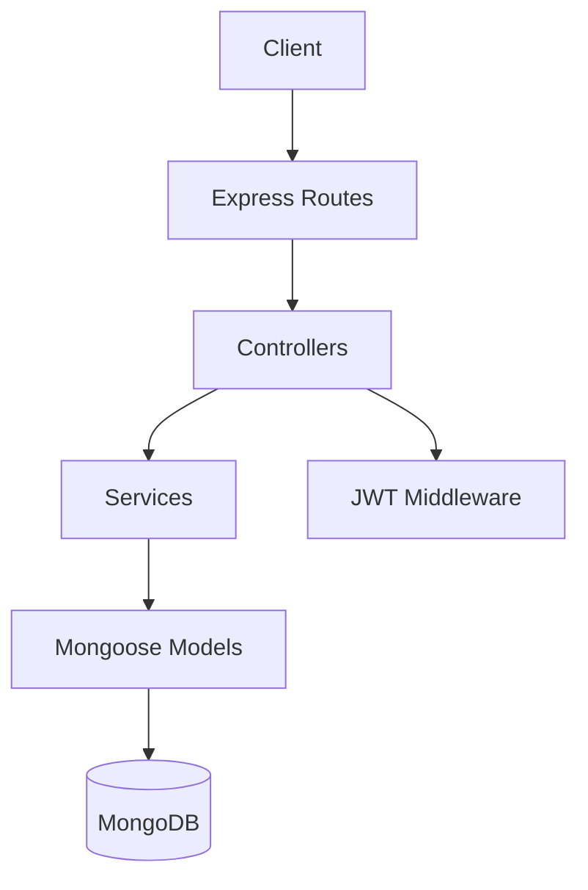
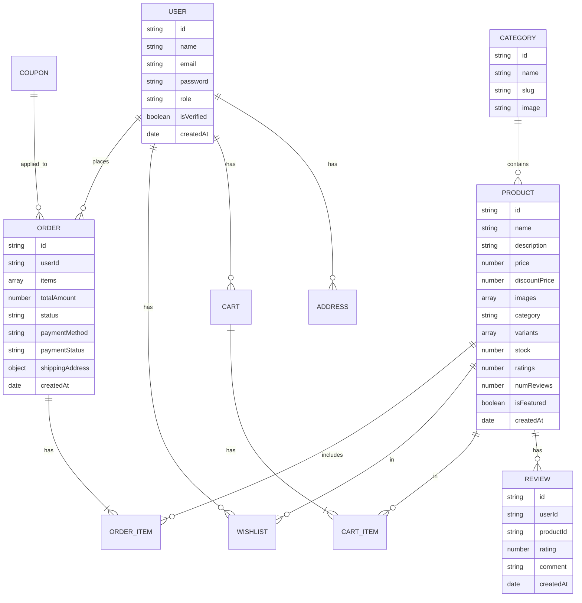

## 1. Architecture Design
```mermaid
graph TD
    Frontend[Next.js 15 Frontend] --> Backend[Node.js/Express Backend]
    Backend --> MongoDB[(MongoDB Atlas)]
    Frontend --> Cloudinary[Cloudinary (Image Storage)]
    Backend --> Stripe[Stripe Payment]
    Backend --> Razorpay[Razorpay Payment]
    Backend --> Nodemailer[Nodemailer]
```

## 2. Technology Description
- Frontend: Next.js 15 (App Router) + TypeScript + Tailwind CSS v4 + Framer Motion + GSAP + Lenis + React Hook Form + Zod + Axios + React Icons + Lucide React + Swiper.js + Shadcn UI + Radix UI + Zustand + TanStack Query
- Backend: Node.js + Express.js + TypeScript + Mongoose + JWT + Bcrypt + Multer + Cloudinary + Nodemailer + Stripe + Razorpay
- Database: MongoDB Atlas
- Deployment: Vercel (Frontend), Render/Railway (Backend)

## 3. Route Definitions
| Route | Purpose |
|-------|---------|
| / | Homepage |
| /shop | Shop page with filters |
| /product/[id] | Product details page |
| /auth/login | Login page |
| /auth/signup | Signup page |
| /user/dashboard | User dashboard |
| /admin | Admin dashboard |

## 4. API Definitions
### Auth
- POST /api/auth/signup
- POST /api/auth/login
- POST /api/auth/forgot-password
- POST /api/auth/verify-otp

### Products
- GET /api/products
- GET /api/products/:id
- POST /api/products (admin)
- PUT /api/products/:id (admin)
- DELETE /api/products/:id (admin)

### Orders
- GET /api/orders (user/admin)
- POST /api/orders (user)
- PUT /api/orders/:id/status (admin)

## 5. Server Architecture Diagram


## 6. Data Model
### 6.1 Data Model Definition

