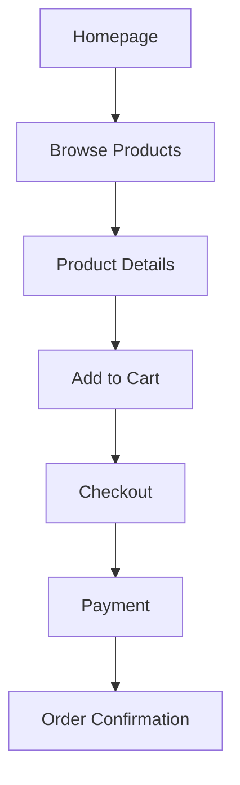

## 1. Product Overview
Luxury premium organic Makhana (Fox Nuts) eCommerce platform designed for health-conscious consumers seeking high-quality, organic snacks. Elevates snack shopping to a premium experience with Apple/Nike/Tesla-inspired UI/UX, combining elegance, modernity, and smooth interactivity.
- Target users: Health-conscious individuals, premium food enthusiasts, gift shoppers
- Market value: Positioning as a luxury organic snack brand

## 2. Core Features

### 2.1 User Roles
| Role | Registration Method | Core Permissions |
|------|-------------------|------------------|
| Normal User | Email/Password | Browse products, manage cart, orders, wishlist, profile |
| Admin | Email/Password | Full CRUD operations, analytics, order management |

### 2.2 Feature Module
1. **Home page**: Premium navbar, hero, trusted by, featured categories, best sellers, health benefits, why choose us, recipes, testimonials, Instagram gallery, newsletter, footer
2. **Product page**: Gallery, zoom, variants, quantity, reviews, related products
3. **Shop page**: Advanced filters, infinite scroll, grid/list views
4. **User dashboard**: Profile, orders, wishlist, addresses, coupons, notifications
5. **Admin panel**: Analytics, products CRUD, orders, customers, inventory, coupons
6. **Auth**: Signup, login, forgot password, OTP verification

### 2.3 Page Details
| Page Name | Module Name | Feature description |
|-----------|-------------|---------------------|
| Home page | Hero Section | Fullscreen hero, animated text, CTA buttons, parallax, floating elements |
| Home page | Navbar | Transparent, sticky on scroll, mega menu, search, wishlist, cart, user, dark mode |
| Product Page | Product Gallery | Large images, zoom, 360 view, variant selection |
| Shop Page | Advanced Filters | Price, rating, category, flavor, availability, sort |

## 3. Core Process
User visits homepage → browses categories/shop → views product details → adds to cart → checkout → payment → order confirmation → order history.

## 4. User Interface Design
### 4.1 Design Style
- Primary: #D4A017
- Secondary: #FFF8E7
- Accent: #6B4226
- Dark: #111111
- Background: #FAFAFA
- Buttons: Rounded, glassmorphism, animated
- Fonts: Clash Display (heading), Inter (body)
- Layout: Generous whitespace, rounded cards, glassmorphism
- Icons: Lucide React

### 4.2 Page Design Overview
| Page Name | Module Name | UI Elements |
|-----------|-------------|-------------|
| Home page | Hero Section | Large product image, animated text reveal, CTA buttons with glow effects |
| Home page | Product Cards | Floating, 3D hover, quick view, add to cart, wishlist |

### 4.3 Responsiveness
Desktop-first, fully responsive for mobile, tablet, desktop
